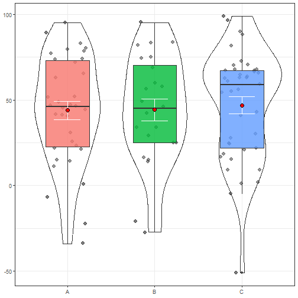

``` r
source("~/Codigos úteis/R program/df_ficticio.R", echo=TRUE)
```

```
## 
## > # Tamanho da amostra
## > tamanho_amostra = 100
## 
## > n = tamanho_amostra / 2
## 
## > # Criando uma coluna de desfecho (não/sim)
## > desfecho = c(rep("não", n), rep("sim", n))
## 
## > # Filtros para separar os grupos
## > filtro_nao = desfecho == "não"
## 
## > filtro_sim = desfecho == "sim"
## 
## > # Criando um DataFrame vazio com a coluna 'desfecho'
## > df = data.frame(desfecho = desfecho)
## 
## > #### Preenchendo os dados numéricos ####
## > 
## > # Desfecho numerico
## > df$desfecho_num = NA
## 
## > df$desfecho_num[filtro_nao] = round(rnorm(n, mean = 30, sd = 40))
## 
## > df$desfecho_num[filtro_sim] = round(rnorm(n, mean = 60, sd = 40))
## 
## > # Idade
## > df$idade = NA
## 
## > df$idade[filtro_nao] = round(rnorm(n, mean = 30, sd = 10))
## 
## > df$idade[filtro_sim] = round(rnorm(n, mean = 60, sd = 40))
## 
## > df$terceira_idade = ifelse(df$idade >= 65, 1, 0)
## 
## > df$idade_media = ifelse(df$idade >= mean(df$idade), 1, 0)
## 
## > # Altura
## > df$altura = NA
## 
## > df$altura[filtro_nao] = rpois(n, 150)
## 
## > df$altura[filtro_sim] = rpois(n, 180)
## 
## > df$altura = df$altura/100
## 
## > df$alto = ifelse(df$altura >= 1.8, 1, 0)
## 
## > df$alto_media = ifelse(df$altura >= mean(df$altura), 1, 0)
## 
## > # Peso
## > df$peso = NA
## 
## > df$peso[filtro_nao] = round(rnorm(n, mean = 50, sd = 20))
## 
## > df$peso[filtro_sim] = round(rnorm(n, mean = 80, sd = 20))
## 
## > df$peso_media = ifelse(df$peso >= mean(df$peso), 1, 0)
## 
## > df$imc = df$peso / (df$altura^2)
## 
## > df$obeso = ifelse(df$imc >= 35, 1, 0)
## 
## > # Preenchendo os dados categóricos
## > df$genero = NA
## 
## > df$genero[filtro_nao] = sample(c("F", "M"), size = n, replace = TRUE, prob = c(0.7, 0.3))
## 
## > df$genero[filtro_sim] = sample(c("F", "M"), size = n, replace = TRUE, prob = c(0.4, 0.6))
## 
## > df$genero_pcr = NA
## 
## > df$genero_pcr[filtro_nao] = sample(c("F", "M"), size = n, replace = TRUE, prob = c(0.7, 0.3))
## 
## > df$genero_pcr[filtro_sim] = sample(c("F", "M"), size = n, replace = TRUE, prob = c(0.4, 0.6))
## 
## > df$tabagismo = NA
## 
## > df$tabagismo[filtro_nao] = sample(c("não", "sim"), size = n, replace = TRUE, prob = c(0.4, 0.6))
## 
## > df$tabagismo[filtro_sim] = sample(c("não", "sim"), size = n, replace = TRUE, prob = c(0.3, 0.7))
## 
## > df$avc_previo = NA
## 
## > df$avc_previo[filtro_nao] = sample(c("não", "sim"), size = n, replace = TRUE, prob = c(0.3, 0.7))
## 
## > df$avc_previo[filtro_sim] = sample(c("não", "sim"), size = n, replace = TRUE, prob = c(0.5, 0.5))
## 
## > df$hipo = NA
## 
## > df$hipo[filtro_nao] = sample(c("não", "sim"), size = n, replace = TRUE, prob = c(0.2, 0.8))
## 
## > df$hipo[filtro_sim] = sample(c("não", "sim"), size = n, replace = TRUE, prob = c(0.3, 0.7))
## 
## > df$has = NA
## 
## > df$has[filtro_nao] = sample(c("não", "sim"), size = n, replace = TRUE, prob = c(0.5, 0.5))
## 
## > df$has[filtro_sim] = sample(c("não", "sim"), size = n, replace = TRUE, prob = c(0.2, 0.8))
## 
## > df$dm = NA
## 
## > df$dm[filtro_nao] = sample(c("não", "sim"), size = n, replace = TRUE, prob = c(0.8, 0.2))
## 
## > df$dm[filtro_sim] = sample(c("não", "sim"), size = n, replace = TRUE, prob = c(0.3, 0.7))
## 
## > df$doenca_cardiaca = NA
## 
## > df$doenca_cardiaca[filtro_nao] = sample(c("não", "sim"), size = n, replace = TRUE, prob = c(0.2, 0.8))
## 
## > df$doenca_cardiaca[filtro_sim] = sample(c("não", "sim"), size = n, replace = TRUE, prob = c(0.6, 0.4))
## 
## > df$asa = NA
## 
## > df$asa[filtro_nao] = sample(c("1", "2", "3"), size = n, replace = TRUE)
## 
## > df$asa[filtro_sim] = sample(c("1", "2", "3"), size = n, replace = TRUE, prob = c(0.2, 0.3, 0.5))
## 
## > df$FC = NA
## 
## > df$FC[filtro_nao] = runif(n, min = 50, max = 90)
## 
## > df$FC[filtro_sim] = runif(n, min = 30, max = 140)
## 
## > df$tratamentos[filtro_nao] = sample(c('A','B','C'), size = n, replace = TRUE, prob = c(0.6, 0.3, 0.1))
## 
## > df$tratamentos[filtro_sim] = sample(c('A','B','C'), size = n, replace = TRUE, prob = c(0.1, 0.3, 0.6))
## 
## > # Filtros para separar os grupos tratamentos
## > filtro_A = df$tratamentos == "A"
## 
## > filtro_B = df$tratamentos == "B"
## 
## > filtro_C = df$tratamentos == "C"
## 
## > # Preenchendo os momentos
## > df$momento_1 = rnorm(tamanho_amostra, mean = 50, sd = 30) #runif(tamanho_amostra, min = 0, max = 100)
## 
## > df$momento_2 = df$momento_1
## 
## > df$momento_2[filtro_A] = df$momento_2[filtro_A] + rnorm(sum(filtro_A), mean = 50, sd = 20)
## 
## > df$momento_2[filtro_B] = df$momento_2[filtro_B] + rnorm(sum(filtro_B), mean = 50, sd = 20)
## 
## > df$momento_2[filtro_C] = df$momento_2[filtro_C] - rnorm(sum(filtro_C), mean = 50, sd = 20)
## 
## > df$momento_3 = df$momento_2
## 
## > df$momento_3[filtro_A] = df$momento_3[filtro_A] - rnorm(sum(filtro_A), mean = 100, sd = 10)
## 
## > df$momento_3[filtro_B] = df$momento_3[filtro_B] + rnorm(sum(filtro_B), mean = 50, sd = 10)
## 
## > df$momento_3[filtro_C] = df$momento_3[filtro_C] + rnorm(sum(filtro_C), mean = 50, sd = 10)
## 
## > df$var_num = NA
## 
## > df$var_num[filtro_nao] = round(rnorm(n, mean = 45, sd = 30))
## 
## > df$var_num[filtro_sim] = round(rnorm(n, mean = 60, sd = 30))
## 
## > #### Arrumando niveis
## > for (coluna in names(df)){
## +   classe = df[[coluna]] %>% class()
## +   levels = df[[coluna]] %>% as.factor() %>% levels()
## +    .... [TRUNCATED] 
## 
## > df
##    desfecho desfecho_num idade terceira_idade idade_media altura alto alto_media peso peso_media
## 1         0           31    28              0           0   1.49    0          0   34          0
## 2         0           12    34              0           0   1.47    0          0   43          0
## 3         0           57    35              0           0   1.47    0          0   51          0
## 4         0            0    32              0           0   1.53    0          0   39          0
## 5         0           45    69              1           1   1.49    0          0    9          0
## 6         0           51    23              0           0   1.34    0          0   57          0
## 7         0          -17    31              0           0   1.55    0          0   80          1
## 8         0           20    37              0           0   1.64    0          0   53          0
## 9         0           -1    20              0           0   1.58    0          0   32          0
## 10        0           59    30              0           0   1.23    0          0   66          1
## 11        0          -28    34              0           0   1.48    0          0   45          0
## 12        0           -2    22              0           0   1.56    0          0   35          0
## 13        0            0    18              0           0   1.61    0          0   57          0
## 14        0           56    27              0           0   1.52    0          0   73          1
## 15        0          -35    31              0           0   1.73    0          1   37          0
## 16        0           59    18              0           0   1.42    0          0   73          1
## 17        0           73    20              0           0   1.47    0          0   55          0
## 18        0           48    36              0           0   1.65    0          1   81          1
## 19        0           16    29              0           0   1.47    0          0   56          0
## 20        0          -11    39              0           0   1.34    0          0   50          0
## 21        0           58    12              0           0   1.36    0          0   63          1
## 22        0          112    44              0           0   1.73    0          1   38          0
## 23        0           83    28              0           0   1.73    0          1   33          0
## 24        0           89    19              0           0   1.60    0          0   42          0
## 25        0           74    16              0           0   1.22    0          0   64          1
## 26        0           76    28              0           0   1.37    0          0   42          0
## 27        0           65    17              0           0   1.54    0          0   55          0
## 28        0            8    28              0           0   1.34    0          0   38          0
## 29        0           51    30              0           0   1.47    0          0   31          0
## 30        0           50    15              0           0   1.58    0          0   63          1
## 31        0          -10    42              0           0   1.41    0          0   72          1
## 32        0           14    33              0           0   1.51    0          0   43          0
## 33        0           -7    33              0           0   1.53    0          0   51          0
## 34        0           30    27              0           0   1.50    0          0   47          0
## 35        0           -6    33              0           0   1.57    0          0   24          0
## 36        0          -37    26              0           0   1.33    0          0   39          0
## 37        0           67    25              0           0   1.46    0          0   19          0
##          imc obeso genero genero_pcr tabagismo avc_previo hipo has dm doenca_cardiaca asa       FC
## 1  15.314625     0      0          0         0          1    1   1  1               1   2 54.61801
## 2  19.899116     0      0          1         1          1    1   0  0               0   3 59.86221
## 3  23.601277     0      0          0         1          1    1   0  0               1   3 76.98449
## 4  16.660259     0      1          0         1          1    1   1  1               1   1 55.33606
## 5   4.053871     0      0          0         0          1    1   0  0               1   2 72.57294
## 6  31.744264     0      0          1         1          1    1   1  0               0   1 53.42304
## 7  33.298647     0      0          0         1          0    1   0  0               1   3 69.75693
## 8  19.705532     0      0          0         1          1    1   1  0               0   2 75.63324
## 9  12.818459     0      1          0         0          1    1   0  1               1   1 81.97255
## 10 43.624826     1      1          0         1          1    0   0  0               1   2 57.90957
## 11 20.544193     0      0          0         1          0    1   0  0               1   1 64.81591
## 12 14.381986     0      0          1         1          1    1   0  0               1   3 74.15232
## 13 21.989892     0      0          1         1          1    1   1  1               1   1 65.03780
## 14 31.596260     0      0          1         0          0    0   1  0               1   1 74.17366
## 15 12.362591     0      0          0         1          1    0   1  0               1   2 89.81883
## 16 36.203134     1      1          0         1          1    1   1  0               0   3 52.68030
## 17 25.452358     0      0          1         1          0    1   0  0               1   1 59.49283
## 18 29.752066     0      1          1         1          1    1   1  0               1   1 56.98818
## 19 25.915128     0      1          1         1          1    1   1  0               0   1 55.08856
## 20 27.845845     0      0          0         1          1    1   0  0               1   2 88.50522
## 21 34.061419     0      0          0         0          1    1   1  0               1   3 75.86435
## 22 12.696716     0      0          1         0          0    0   0  0               1   2 62.03267
## 23 11.026095     0      0          0         0          1    1   1  1               1   2 59.81735
## 24 16.406250     0      1          0         1          1    1   1  1               1   3 88.90278
## 25 42.999194     1      0          0         1          0    0   0  0               1   2 55.33846
## 26 22.377324     0      0          1         0          1    0   1  0               0   1 53.13142
## 27 23.191095     0      1          1         1          1    1   0  0               1   1 79.24780
## 28 21.162843     0      0          0         1          1    0   0  0               1   3 69.35429
## 29 14.345874     0      0          1         1          1    1   1  0               1   1 57.69439
## 30 25.236340     0      0          0         1          1    0   1  0               1   1 61.85126
## 31 36.215482     1      0          0         1          1    1   1  0               1   1 55.34963
## 32 18.858822     0      0          0         1          1    1   1  0               1   1 85.09584
## 33 21.786492     0      0          0         1          0    1   1  0               1   2 67.77177
## 34 20.888889     0      0          0         1          1    1   0  0               0   2 77.27875
## 35  9.736703     0      1          0         0          0    1   1  0               1   3 70.68989
## 36 22.047600     0      0          0         1          1    1   1  0               1   2 81.26044
## 37  8.913492     0      0          0         0          1    1   1  0               1   3 61.59416
##    tratamentos  momento_1   momento_2  momento_3 var_num
## 1            C  62.738252   5.8151564  35.070275      28
## 2            A  38.802376 111.3777482  -7.629058      15
## 3            A  23.418975  73.8277906 -10.981898      52
## 4            A  61.323382 117.6801900   6.438156      14
## 5            C  82.346186  33.1390918  66.696524       2
## 6            A  60.133086  95.0357347   6.980091      72
## 7            B  25.747187 101.0784945 169.019051     -27
## 8            A  27.487137  88.7889216  -9.884351      31
## 9            A  43.986212  81.0027550 -20.558840      47
## 10           C  86.642527  -6.8396599  47.979167     -51
## 11           C  51.514147 -18.0799409  43.400202      82
## 12           A  59.056866  99.3642628  15.822655      74
## 13           C  50.031755  19.2320561  88.276467      24
## 14           A   9.931683  39.9434775 -58.185444      22
## 15           A  69.481036 148.0910733  61.394953      42
## 16           B  50.222242 122.9658083 159.319657      60
## 17           A  40.332676  41.2972248 -58.038552      83
## 18           A  56.942721 100.4283897  -3.064983      11
## 19           A  48.209598 104.0716139   5.926883      63
## 20           A  91.094890 146.8175818  23.411316      21
## 21           A  99.399000 101.3235077   5.603793      45
## 22           A  62.710275  72.6966180 -34.547084      95
## 23           C  93.317881  47.0868025 105.129090      -5
## 24           A  26.897761  71.2079361 -30.886860      23
## 25           A  40.327774  94.2564608 -13.445500      -7
## 26           B 111.272560 163.3644721 223.749115      75
## 27           A  67.046272  98.7746386  -1.402843      80
## 28           A  16.811680  38.4914589 -55.341643      41
## 29           B 112.889040 191.1632851 253.076331      16
## 30           A  31.620944 111.3050347   9.786572      49
## 31           A 104.763350 158.0314771  64.667249      44
## 32           A  84.258996 118.0086750  17.703305     -22
## 33           C  54.177880   7.2066734  43.797884      63
## 34           C  42.731839   0.6633994  61.211165       1
## 35           A  72.305334 127.8002672  29.398259      52
## 36           A  -3.331440  27.4793509 -64.719388      65
## 37           A  33.997161  96.2701138  -3.705911      80
##  [ reached 'max' / getOption("max.print") -- omitted 63 rows ]
```

``` r
df
```

```
##    desfecho desfecho_num idade terceira_idade idade_media altura alto alto_media peso peso_media
## 1         0           31    28              0           0   1.49    0          0   34          0
## 2         0           12    34              0           0   1.47    0          0   43          0
## 3         0           57    35              0           0   1.47    0          0   51          0
## 4         0            0    32              0           0   1.53    0          0   39          0
## 5         0           45    69              1           1   1.49    0          0    9          0
## 6         0           51    23              0           0   1.34    0          0   57          0
## 7         0          -17    31              0           0   1.55    0          0   80          1
## 8         0           20    37              0           0   1.64    0          0   53          0
## 9         0           -1    20              0           0   1.58    0          0   32          0
## 10        0           59    30              0           0   1.23    0          0   66          1
## 11        0          -28    34              0           0   1.48    0          0   45          0
## 12        0           -2    22              0           0   1.56    0          0   35          0
## 13        0            0    18              0           0   1.61    0          0   57          0
## 14        0           56    27              0           0   1.52    0          0   73          1
## 15        0          -35    31              0           0   1.73    0          1   37          0
## 16        0           59    18              0           0   1.42    0          0   73          1
## 17        0           73    20              0           0   1.47    0          0   55          0
## 18        0           48    36              0           0   1.65    0          1   81          1
## 19        0           16    29              0           0   1.47    0          0   56          0
## 20        0          -11    39              0           0   1.34    0          0   50          0
## 21        0           58    12              0           0   1.36    0          0   63          1
## 22        0          112    44              0           0   1.73    0          1   38          0
## 23        0           83    28              0           0   1.73    0          1   33          0
## 24        0           89    19              0           0   1.60    0          0   42          0
## 25        0           74    16              0           0   1.22    0          0   64          1
## 26        0           76    28              0           0   1.37    0          0   42          0
## 27        0           65    17              0           0   1.54    0          0   55          0
## 28        0            8    28              0           0   1.34    0          0   38          0
## 29        0           51    30              0           0   1.47    0          0   31          0
## 30        0           50    15              0           0   1.58    0          0   63          1
## 31        0          -10    42              0           0   1.41    0          0   72          1
## 32        0           14    33              0           0   1.51    0          0   43          0
## 33        0           -7    33              0           0   1.53    0          0   51          0
## 34        0           30    27              0           0   1.50    0          0   47          0
## 35        0           -6    33              0           0   1.57    0          0   24          0
## 36        0          -37    26              0           0   1.33    0          0   39          0
## 37        0           67    25              0           0   1.46    0          0   19          0
##          imc obeso genero genero_pcr tabagismo avc_previo hipo has dm doenca_cardiaca asa       FC
## 1  15.314625     0      0          0         0          1    1   1  1               1   2 54.61801
## 2  19.899116     0      0          1         1          1    1   0  0               0   3 59.86221
## 3  23.601277     0      0          0         1          1    1   0  0               1   3 76.98449
## 4  16.660259     0      1          0         1          1    1   1  1               1   1 55.33606
## 5   4.053871     0      0          0         0          1    1   0  0               1   2 72.57294
## 6  31.744264     0      0          1         1          1    1   1  0               0   1 53.42304
## 7  33.298647     0      0          0         1          0    1   0  0               1   3 69.75693
## 8  19.705532     0      0          0         1          1    1   1  0               0   2 75.63324
## 9  12.818459     0      1          0         0          1    1   0  1               1   1 81.97255
## 10 43.624826     1      1          0         1          1    0   0  0               1   2 57.90957
## 11 20.544193     0      0          0         1          0    1   0  0               1   1 64.81591
## 12 14.381986     0      0          1         1          1    1   0  0               1   3 74.15232
## 13 21.989892     0      0          1         1          1    1   1  1               1   1 65.03780
## 14 31.596260     0      0          1         0          0    0   1  0               1   1 74.17366
## 15 12.362591     0      0          0         1          1    0   1  0               1   2 89.81883
## 16 36.203134     1      1          0         1          1    1   1  0               0   3 52.68030
## 17 25.452358     0      0          1         1          0    1   0  0               1   1 59.49283
## 18 29.752066     0      1          1         1          1    1   1  0               1   1 56.98818
## 19 25.915128     0      1          1         1          1    1   1  0               0   1 55.08856
## 20 27.845845     0      0          0         1          1    1   0  0               1   2 88.50522
## 21 34.061419     0      0          0         0          1    1   1  0               1   3 75.86435
## 22 12.696716     0      0          1         0          0    0   0  0               1   2 62.03267
## 23 11.026095     0      0          0         0          1    1   1  1               1   2 59.81735
## 24 16.406250     0      1          0         1          1    1   1  1               1   3 88.90278
## 25 42.999194     1      0          0         1          0    0   0  0               1   2 55.33846
## 26 22.377324     0      0          1         0          1    0   1  0               0   1 53.13142
## 27 23.191095     0      1          1         1          1    1   0  0               1   1 79.24780
## 28 21.162843     0      0          0         1          1    0   0  0               1   3 69.35429
## 29 14.345874     0      0          1         1          1    1   1  0               1   1 57.69439
## 30 25.236340     0      0          0         1          1    0   1  0               1   1 61.85126
## 31 36.215482     1      0          0         1          1    1   1  0               1   1 55.34963
## 32 18.858822     0      0          0         1          1    1   1  0               1   1 85.09584
## 33 21.786492     0      0          0         1          0    1   1  0               1   2 67.77177
## 34 20.888889     0      0          0         1          1    1   0  0               0   2 77.27875
## 35  9.736703     0      1          0         0          0    1   1  0               1   3 70.68989
## 36 22.047600     0      0          0         1          1    1   1  0               1   2 81.26044
## 37  8.913492     0      0          0         0          1    1   1  0               1   3 61.59416
##    tratamentos  momento_1   momento_2  momento_3 var_num
## 1            C  62.738252   5.8151564  35.070275      28
## 2            A  38.802376 111.3777482  -7.629058      15
## 3            A  23.418975  73.8277906 -10.981898      52
## 4            A  61.323382 117.6801900   6.438156      14
## 5            C  82.346186  33.1390918  66.696524       2
## 6            A  60.133086  95.0357347   6.980091      72
## 7            B  25.747187 101.0784945 169.019051     -27
## 8            A  27.487137  88.7889216  -9.884351      31
## 9            A  43.986212  81.0027550 -20.558840      47
## 10           C  86.642527  -6.8396599  47.979167     -51
## 11           C  51.514147 -18.0799409  43.400202      82
## 12           A  59.056866  99.3642628  15.822655      74
## 13           C  50.031755  19.2320561  88.276467      24
## 14           A   9.931683  39.9434775 -58.185444      22
## 15           A  69.481036 148.0910733  61.394953      42
## 16           B  50.222242 122.9658083 159.319657      60
## 17           A  40.332676  41.2972248 -58.038552      83
## 18           A  56.942721 100.4283897  -3.064983      11
## 19           A  48.209598 104.0716139   5.926883      63
## 20           A  91.094890 146.8175818  23.411316      21
## 21           A  99.399000 101.3235077   5.603793      45
## 22           A  62.710275  72.6966180 -34.547084      95
## 23           C  93.317881  47.0868025 105.129090      -5
## 24           A  26.897761  71.2079361 -30.886860      23
## 25           A  40.327774  94.2564608 -13.445500      -7
## 26           B 111.272560 163.3644721 223.749115      75
## 27           A  67.046272  98.7746386  -1.402843      80
## 28           A  16.811680  38.4914589 -55.341643      41
## 29           B 112.889040 191.1632851 253.076331      16
## 30           A  31.620944 111.3050347   9.786572      49
## 31           A 104.763350 158.0314771  64.667249      44
## 32           A  84.258996 118.0086750  17.703305     -22
## 33           C  54.177880   7.2066734  43.797884      63
## 34           C  42.731839   0.6633994  61.211165       1
## 35           A  72.305334 127.8002672  29.398259      52
## 36           A  -3.331440  27.4793509 -64.719388      65
## 37           A  33.997161  96.2701138  -3.705911      80
##  [ reached 'max' / getOption("max.print") -- omitted 63 rows ]
```


``` r
library(ggplot2) # graficos
library(ggthemes) # temas ggplot
library(scales) # escalas dos eixos
library(patchwork) # graficos lado a lado => (graf1 + graf2)/graf3
library(gridExtra) # graficos lado a lado 2 => grid.arrange(p1, p2, ncol=2)

# library(ggpubr) #ggplot (+estatistica) facilitado
# library(ggsignif) #significancia entre grupos
```


``` r
# https://ggplot2-book.org/themes
# https://ggplot2-book.org/themes#sec-themes

tema = theme_bw(base_family = "Times New Roman")

elementos_tema = theme_update( #theme(
  # Titulo
  plot.title = element_text(face = "bold", colour = "black"),
  # Painel -> https://ggplot2-book.org/themes#panel-elements
  panel.background = element_rect(fill = "white", color = NA), # Background - Plano de Fundo
  panel.grid.major = element_line(color = "grey80", linewidth = 2, linetype = "dotted"), # Grade
  panel.grid.minor = element_line(color = "grey90"),
  # Eixos -> https://ggplot2-book.org/themes#sec-theme-axis
  axis.title.x = element_text(size = 12, face = "bold"), # Titulo
  axis.title.y = element_text(size = 12, face = "bold", angle = -30),
  axis.text.x = element_text(size = 10), # Labels
  axis.text.y = element_text(size = 10),
  axis.line = element_line(color = "black"),
  # Legenda -> https://ggplot2-book.org/themes#legend-elements
  #legend.position = "bottom",
  legend.title = element_text(size = 12, face = "bold"),
  legend.text = element_text(size = 10),
  plot.margin = margin(10, 10, 10, 10) # Margem
)

theme_set(tema)

# element_blank() #Nada
# facet_wrap() facet_grid() -> https://ggplot2-book.org/themes#faceting-elements
# font face -> https://ggplot2.tidyverse.org/articles/ggplot2-specs.html#font-face
# themes -> https://ggplot2.tidyverse.org/reference/ggtheme.html
```


# Representar Proporções


``` r
cont_grafi = function(df, coluna){
  # Criando tabela de contagem
  tabela = df %>% filter(!is.na(!!sym(coluna))) %>% 
    group_by(!!sym(coluna)) %>% 
    summarise(n = n()) %>% mutate(Freq = round(n/sum(n)*100, 2)) %>% ungroup()
  
  ggplot(tabela, aes(x=as.factor(!!sym(coluna)), y=Freq, label=Freq, fill=as.factor(!!sym(coluna)))) + 
    geom_col(show.legend=FALSE, color="black") + 
    geom_text(aes(y=Freq, label = sprintf("%0.1f%%", Freq), vjust=-0.2)) + 
    theme(legend.position = "bottom") +
    scale_y_continuous(limits = c(0, 100), breaks=seq(from = 0, to = 100, by = 20)) +
    labs(x=NULL, y="Frequency (%)", title =NULL)
}

cont_grafi(df, 'desfecho')
```

```
## Warning in grid.Call(C_textBounds, as.graphicsAnnot(x$label), x$x, x$y, : font family not found in
## Windows font database
## Warning in grid.Call(C_textBounds, as.graphicsAnnot(x$label), x$x, x$y, : font family not found in
## Windows font database
```

```
## Warning in grid.Call.graphics(C_text, as.graphicsAnnot(x$label), x$x, x$y, : font family not found
## in Windows font database
## Warning in grid.Call.graphics(C_text, as.graphicsAnnot(x$label), x$x, x$y, : font family not found
## in Windows font database
## Warning in grid.Call.graphics(C_text, as.graphicsAnnot(x$label), x$x, x$y, : font family not found
## in Windows font database
```


``` r
cont_grafi(df, 'tratamentos')
```

```
## Warning in grid.Call(C_textBounds, as.graphicsAnnot(x$label), x$x, x$y, : font family not found in
## Windows font database
```

```
## Warning in grid.Call(C_textBounds, as.graphicsAnnot(x$label), x$x, x$y, : font family not found in
## Windows font database
```

```
## Warning in grid.Call.graphics(C_text, as.graphicsAnnot(x$label), x$x, x$y, : font family not found
## in Windows font database
## Warning in grid.Call.graphics(C_text, as.graphicsAnnot(x$label), x$x, x$y, : font family not found
## in Windows font database
## Warning in grid.Call.graphics(C_text, as.graphicsAnnot(x$label), x$x, x$y, : font family not found
## in Windows font database
```


``` r
#ggsave("nome_grafico.png", height=15, width=20, units="cm", dpi= 600)
```


``` r
#para representar uma tabela de contingencia (categorica vs categorica)

conti_grafi = function(df, coluna_x, coluna_y, sentido_percent='col'){
  
  if (sentido_percent == 'row'){ #algoritmo de troca troca #la_ele #kapa_pride
    temp = coluna_x
    coluna_x = coluna_y
    coluna_y = temp
  }
  
  # Criando tabela de contagem
  grafi = df %>% filter(!is.na(!!sym(coluna_x)) & !is.na(!!sym(coluna_y))) %>% 
    group_by(!!sym(coluna_y), !!sym(coluna_x)) %>% 
    summarise(n = n()) %>% mutate(Freq = round(n/sum(n)*100, 2)) %>% ungroup()
  
  ggplot(grafi, aes(x=as.factor(!!sym(coluna_y)), y=Freq, fill=as.factor(!!sym(coluna_x)))) + 
    # Grafico
    geom_bar(stat="identity", position=position_dodge(preserve = 'single'), color='black') +
    # Outros
    geom_text(aes(y=Freq, label = sprintf("%0.1f%%", Freq)), position=position_dodge(0.75), vjust=-0.2, hjust=0.5) +
    theme(legend.position = "bottom") +
    scale_y_continuous(labels = scales::percent) +
    scale_y_continuous(limits = c(0, 100), breaks=seq(from=0, to=100, by=10)) +
    labs(x=NULL, y='Frequency (%)', title=NULL, fill=NULL)
}

conti_grafi(df, 'desfecho', 'tratamentos')
```

```
## `summarise()` has grouped output by 'tratamentos'. You can override using the `.groups` argument.
## Scale for y is already present. Adding another scale for y, which will replace the existing scale.
```

```
## Warning in grid.Call(C_textBounds, as.graphicsAnnot(x$label), x$x, x$y, : font family not found in
## Windows font database
## Warning in grid.Call(C_textBounds, as.graphicsAnnot(x$label), x$x, x$y, : font family not found in
## Windows font database
```

```
## Warning in grid.Call.graphics(C_text, as.graphicsAnnot(x$label), x$x, x$y, : font family not found
## in Windows font database
## Warning in grid.Call.graphics(C_text, as.graphicsAnnot(x$label), x$x, x$y, : font family not found
## in Windows font database
## Warning in grid.Call.graphics(C_text, as.graphicsAnnot(x$label), x$x, x$y, : font family not found
## in Windows font database
## Warning in grid.Call.graphics(C_text, as.graphicsAnnot(x$label), x$x, x$y, : font family not found
## in Windows font database
```

-1.png)

``` r
#ggsave("nome_grafico.png", height=15, width=20, units="cm", dpi= 600)
```

# Representar numeros


``` r
# para representar analise númerica por grupo (variavel: numerica vs categorica)

box_vin_jit = function(df, col_num, col_cat){
  ggplot(df, aes(x=as.factor(!!sym(col_cat)), y=!!sym(col_num), fill=as.factor(!!sym(col_cat)))) + 
    # Graficos
    geom_jitter(alpha=0.5, show.legend=F, size=2.5, position=position_jitter(0.25)) +
    geom_violin(alpha=0.2, show.legend=F, fill='white') +
    geom_boxplot(alpha=0.8, show.legend=F, width=0.5) + #outlier.shape = NA
    # Medias extras
    geom_errorbar(stat = "summary", fun.data = "mean_se", width= 0.3, color="white") + 
    geom_point(stat = "summary", fun = "mean", show.legend=F, 
               shape=21, fill='red', color="black", size=3) +
    # Outros
    theme(legend.position = "bottom") +
    labs(x=NULL, y=NULL, title=NULL)
}

box_vin_jit(df, 'var_num', 'tratamentos')
```

```
## Warning in grid.Call(C_textBounds, as.graphicsAnnot(x$label), x$x, x$y, : font family not found in
## Windows font database
```



``` r
box_vin_jit(df, 'var_num', 'desfecho')
```


``` r
#ggsave("nome_grafico.png", height=10, width=10.5, units="cm", dpi= 600)
```


``` r
# para representar amostras pareadas

box_pareado = function(df_selecionado, palavra_padrao_da_coluna_analisada){
  df_filter = na.omit(df_selecionado)

  # Transformando para o formato longo
  df_filter$ID = 1:nrow(df_filter)
  dados_long = pivot_longer(df_filter, cols = starts_with(palavra_padrao_da_coluna_analisada), 
                             names_to = "momentos", values_to = "medida_numerica")
  
  # Grafico
  ggplot() +
    geom_boxplot(data=dados_long, aes(x=as.factor(momentos), y=medida_numerica, color=as.factor(momentos)),
                 alpha=0.5, fill = 'white', show.legend = F) +
    geom_point(data=dados_long, aes(x=as.factor(momentos), y=medida_numerica, color=as.factor(momentos)),
               alpha=0.5, size=2.5, show.legend = F) + 
    geom_line(data=dados_long, aes(x=as.factor(momentos), y=medida_numerica, color=as.factor(momentos), group = ID),
              alpha=0.5, show.legend = F) +
    labs(x=NULL, y=NULL, title=NULL) + 
    theme(legend.position = "none")
}

box_pareado(df[c('momento_1', 'momento_2', 'momento_3')], 'momento')
```

```
## Error in pivot_longer(df_filter, cols = starts_with(palavra_padrao_da_coluna_analisada), : não foi possível encontrar a função "pivot_longer"
```

``` r
box_pareado(df[c('momento_1', 'momento_2', 'momento_3', 'tratamentos')], 'momento') + facet_grid(~tratamentos)
```

```
## Error in pivot_longer(df_filter, cols = starts_with(palavra_padrao_da_coluna_analisada), : não foi possível encontrar a função "pivot_longer"
```


``` r
# para representar média e desvio padrão (variavel: numerico (categorica vs categorica) )

dinamite = function(df, col_num, col_cat){
  # Tabela com medidas
  tabela = df %>% filter(!is.na(!!sym(col_cat))) %>% 
    group_by(!!sym(col_cat)) %>%
    summarise(
      mean = mean(!!sym(col_num), na.rm = TRUE),
      sd = sd(!!sym(col_num), na.rm = TRUE)) %>% 
    mutate(ymin= mean - sd,
           ymax= mean + sd)
  tabela$ymin = ifelse(tabela$ymin <= 0, 0.01, tabela$ymin)
  
  ggplot(tabela, aes(x=as.factor(!!sym(col_cat)), y=mean, fill=as.factor(!!sym(col_cat)))) +
    # Grafico
    geom_bar(stat="summary", fun="mean", color='black', position=position_dodge(0.75)) +
    geom_errorbar(aes(ymin=ymin, ymax=ymax), width=0.3, position=position_dodge(0.75)) +
    geom_point(stat="summary", fun="mean", position=position_dodge(0.75),
               shape=21, fill='grey70', color="black", size=2) +
    # Outros
    geom_text(aes(label= round(mean,0)), position= position_dodge(0.75), 
              vjust=-0.2, hjust=-0.3) +
    theme(legend.position= "none") +
    labs(x=NULL, y= "Mean", title=NULL) #+ coord_flip()
}

dinamite(df, 'momento_3', 'desfecho')
```

```
## Warning in grid.Call(C_textBounds, as.graphicsAnnot(x$label), x$x, x$y, : font family not found in
## Windows font database
## Warning in grid.Call(C_textBounds, as.graphicsAnnot(x$label), x$x, x$y, : font family not found in
## Windows font database
```

```
## Warning in grid.Call.graphics(C_text, as.graphicsAnnot(x$label), x$x, x$y, : font family not found
## in Windows font database
## Warning in grid.Call.graphics(C_text, as.graphicsAnnot(x$label), x$x, x$y, : font family not found
## in Windows font database
## Warning in grid.Call.graphics(C_text, as.graphicsAnnot(x$label), x$x, x$y, : font family not found
## in Windows font database
```


``` r
dinamite(df, 'momento_3', 'tratamentos')
```

```
## Warning in grid.Call(C_textBounds, as.graphicsAnnot(x$label), x$x, x$y, : font family not found in
## Windows font database
```

```
## Warning in grid.Call(C_textBounds, as.graphicsAnnot(x$label), x$x, x$y, : font family not found in
## Windows font database
```

```
## Warning in grid.Call.graphics(C_text, as.graphicsAnnot(x$label), x$x, x$y, : font family not found
## in Windows font database
## Warning in grid.Call.graphics(C_text, as.graphicsAnnot(x$label), x$x, x$y, : font family not found
## in Windows font database
## Warning in grid.Call.graphics(C_text, as.graphicsAnnot(x$label), x$x, x$y, : font family not found
## in Windows font database
```


``` r
grafico_de_erro = function(df, col_num, col_cat){
  # Tabela com medidas
  tabela = df %>% filter(!is.na(!!sym(col_cat))) %>% 
    group_by(!!sym(col_cat)) %>%
    summarise(
      mean = mean(!!sym(col_num), na.rm = TRUE),
      sd = sd(!!sym(col_num), na.rm = TRUE)) %>% 
    mutate(ymin= mean - sd,
           ymax= mean + sd)
  tabela$ymin = ifelse(tabela$ymin <= 0, 0.01, tabela$ymin)
  
  ggplot(tabela, aes(x=as.factor(!!sym(col_cat)), y=mean, color=as.factor(!!sym(col_cat)))) +
    geom_errorbar(aes(ymin=ymin, ymax=ymax), width=0.3, position=position_dodge(0.75)) +
    geom_point(stat="summary", fun="mean", position=position_dodge(0.75),
               shape=21, fill='grey70', color="black", size=4) +
    geom_text(aes(label= round(mean,0)), position= position_dodge(0.75),
              vjust=0.5, hjust=-0.75) +
    theme(legend.position= "none") +
    labs(x=NULL, y= "Mean", title=NULL)
}

grafico_de_erro(df, 'momento_3', 'desfecho')
```

```
## Warning in grid.Call(C_textBounds, as.graphicsAnnot(x$label), x$x, x$y, : font family not found in
## Windows font database
## Warning in grid.Call(C_textBounds, as.graphicsAnnot(x$label), x$x, x$y, : font family not found in
## Windows font database
```

```
## Warning in grid.Call.graphics(C_text, as.graphicsAnnot(x$label), x$x, x$y, : font family not found
## in Windows font database
## Warning in grid.Call.graphics(C_text, as.graphicsAnnot(x$label), x$x, x$y, : font family not found
## in Windows font database
## Warning in grid.Call.graphics(C_text, as.graphicsAnnot(x$label), x$x, x$y, : font family not found
## in Windows font database
```


``` r
grafico_de_erro(df, 'momento_3', 'tratamentos')
```

```
## Warning in grid.Call(C_textBounds, as.graphicsAnnot(x$label), x$x, x$y, : font family not found in
## Windows font database
```

```
## Warning in grid.Call(C_textBounds, as.graphicsAnnot(x$label), x$x, x$y, : font family not found in
## Windows font database
```

```
## Warning in grid.Call.graphics(C_text, as.graphicsAnnot(x$label), x$x, x$y, : font family not found
## in Windows font database
## Warning in grid.Call.graphics(C_text, as.graphicsAnnot(x$label), x$x, x$y, : font family not found
## in Windows font database
## Warning in grid.Call.graphics(C_text, as.graphicsAnnot(x$label), x$x, x$y, : font family not found
## in Windows font database
```


``` r
densidade_grafi = function(df, col_num, col_cat){
  
  if (shapiro.test(df[[col_num]])$p.value == TRUE){
    medidas = df %>% summarize(med = mean(!!sym(col_num)))
  } else {
    medidas = df %>% summarize(med = median(!!sym(col_num)))
  }
  
  ggplot(df, aes(x=!!sym(col_num), fill='tomato')) +
    geom_density(position='identity', alpha =0.5)+
    geom_vline(data = medidas, aes(xintercept = med, color = 'red'), 
               linetype="dashed", size=1, show.legend=F) +
    geom_text(data = medidas, aes(x = med, label = round(med, 1), y = 0), 
              color="black", vjust = -0.5, hjust = 1.5) +
    theme(legend.position = "none") +
    labs(x=NULL, y='Probability Density', fill=NULL)
}

densidade_grafi(df, 'var_num')
```

```
## Warning in grid.Call(C_textBounds, as.graphicsAnnot(x$label), x$x, x$y, : font family not found in
## Windows font database
## Warning in grid.Call(C_textBounds, as.graphicsAnnot(x$label), x$x, x$y, : font family not found in
## Windows font database
```

```
## Warning in grid.Call.graphics(C_text, as.graphicsAnnot(x$label), x$x, x$y, : font family not found
## in Windows font database
## Warning in grid.Call.graphics(C_text, as.graphicsAnnot(x$label), x$x, x$y, : font family not found
## in Windows font database
## Warning in grid.Call.graphics(C_text, as.graphicsAnnot(x$label), x$x, x$y, : font family not found
## in Windows font database
```


``` r
# variavel: numerica vs categorica

densidade_grafi = function(df, col_num, col_cat){
  
  if (normalidade_por_grupo_criterio(df, col_num, col_cat) == TRUE){
    medidas = df %>% group_by(!!sym(col_cat)) %>% summarize(med = mean(!!sym(col_num)))
  } else {
    medidas = df %>% group_by(!!sym(col_cat)) %>% summarize(med = median(!!sym(col_num)))
  }
  
  ggplot(df, aes(x=!!sym(col_num), fill=as.factor(!!sym(col_cat)))) +
    geom_density(position='identity', alpha =0.5)+
    geom_vline(data = medidas, aes(xintercept = med, color = as.factor(!!sym(col_cat))), 
               linetype="dashed", size=1, show.legend=F) +
    geom_text(data = medidas, aes(x = med, label = round(med, 0), y = 0), 
              color="black", vjust = -0.5, hjust = 1.5) +
    theme(legend.position = "bottom") +
    labs(x=NULL, y='Probability Density', fill=NULL)
}

densidade_grafi(df, 'momento_3', 'desfecho')
```

```
## Warning in grid.Call(C_textBounds, as.graphicsAnnot(x$label), x$x, x$y, : font family not found in
## Windows font database
## Warning in grid.Call(C_textBounds, as.graphicsAnnot(x$label), x$x, x$y, : font family not found in
## Windows font database
```

```
## Warning in grid.Call.graphics(C_text, as.graphicsAnnot(x$label), x$x, x$y, : font family not found
## in Windows font database
## Warning in grid.Call.graphics(C_text, as.graphicsAnnot(x$label), x$x, x$y, : font family not found
## in Windows font database
## Warning in grid.Call.graphics(C_text, as.graphicsAnnot(x$label), x$x, x$y, : font family not found
## in Windows font database
## Warning in grid.Call.graphics(C_text, as.graphicsAnnot(x$label), x$x, x$y, : font family not found
## in Windows font database
```


``` r
densidade_grafi(df, 'momento_3', 'desfecho') + facet_grid(~desfecho)
```

```
## Warning in grid.Call(C_textBounds, as.graphicsAnnot(x$label), x$x, x$y, : font family not found in
## Windows font database
## Warning in grid.Call(C_textBounds, as.graphicsAnnot(x$label), x$x, x$y, : font family not found in
## Windows font database
## Warning in grid.Call(C_textBounds, as.graphicsAnnot(x$label), x$x, x$y, : font family not found in
## Windows font database
## Warning in grid.Call(C_textBounds, as.graphicsAnnot(x$label), x$x, x$y, : font family not found in
## Windows font database
## Warning in grid.Call(C_textBounds, as.graphicsAnnot(x$label), x$x, x$y, : font family not found in
## Windows font database
```


``` r
densidade_grafi(df, 'momento_3', 'tratamentos') + facet_grid(~tratamentos)
```

```
## Warning in grid.Call(C_textBounds, as.graphicsAnnot(x$label), x$x, x$y, : font family not found in
## Windows font database
## Warning in grid.Call(C_textBounds, as.graphicsAnnot(x$label), x$x, x$y, : font family not found in
## Windows font database
## Warning in grid.Call(C_textBounds, as.graphicsAnnot(x$label), x$x, x$y, : font family not found in
## Windows font database
## Warning in grid.Call(C_textBounds, as.graphicsAnnot(x$label), x$x, x$y, : font family not found in
## Windows font database
## Warning in grid.Call(C_textBounds, as.graphicsAnnot(x$label), x$x, x$y, : font family not found in
## Windows font database
```


``` r
teste_normalidade = function(df, coluna, qtd_bins=20, cor_esc=1){
  media = mean(df[[coluna]], na.rm=T)
  desvpad = sd(df[[coluna]], na.rm=T)
  
  if (nrow(df) > 3 & nrow(df) < 5000){
    p_valor = shapiro.test(df[[coluna]])$p.value %>% retorne_p() %>% retorne_p_ajust()
    subtitulo = paste(p_valor, '(Shapiro-wilk)')
  } else {
    p_valor = ks.test(df[[coluna]], "pnorm", mean=media, sd=desvpad)$p.value %>% retorne_p() %>% retorne_p_ajust()
    subtitulo = paste(p_valor, '(Kolmogorov-Smirnov)')
  }
  
  lista_cor0 = c('tomato','#40BCD8','#fdf0d5','#fefee3','#bee9e8','#f6aa1c','grey75') # COR DA BARRA
  lista_cor1 = c('red','black','black','black','black','black','black') # COR DA BARRA
  lista_cor2 = c('red','blue','#c1121f','#d68c45','#1b4965','#941b0c','grey45') # COR DA LINHA
  
  ggplot(df, aes(x=!!sym(coluna)))+
    geom_histogram(aes(y=..density..), bins=qtd_bins, 
                   fill = alpha(lista_cor0[cor_esc], 0.7), 
                   colour = lista_cor1[cor_esc]) +
    geom_density(lwd = 1.2, linetype = 2, colour = lista_cor2[cor_esc]) +
    geom_function(fun= dnorm, args=list(mean=media,sd=desvpad), col='black', lwd=1, lty=4) +
    labs(x=NULL, y='Probability Density', subtitle = subtitulo)
}

teste_normalidade(df, 'var_num', cor_esc = 1)
```

```
## Warning in grid.Call(C_textBounds, as.graphicsAnnot(x$label), x$x, x$y, : font family not found in
## Windows font database
## Warning in grid.Call(C_textBounds, as.graphicsAnnot(x$label), x$x, x$y, : font family not found in
## Windows font database
```

```
## Warning in grid.Call.graphics(C_text, as.graphicsAnnot(x$label), x$x, x$y, : font family not found
## in Windows font database
## Warning in grid.Call.graphics(C_text, as.graphicsAnnot(x$label), x$x, x$y, : font family not found
## in Windows font database
## Warning in grid.Call.graphics(C_text, as.graphicsAnnot(x$label), x$x, x$y, : font family not found
## in Windows font database
## Warning in grid.Call.graphics(C_text, as.graphicsAnnot(x$label), x$x, x$y, : font family not found
## in Windows font database
```


``` r
teste_normalidade(df, 'var_num', cor_esc = 2) #+ facet_grid(~desfecho) + labs(subtitle = NULL)
```

```
## Warning in grid.Call(C_textBounds, as.graphicsAnnot(x$label), x$x, x$y, : font family not found in
## Windows font database
```

```
## Warning in grid.Call(C_textBounds, as.graphicsAnnot(x$label), x$x, x$y, : font family not found in
## Windows font database
```

```
## Warning in grid.Call.graphics(C_text, as.graphicsAnnot(x$label), x$x, x$y, : font family not found
## in Windows font database
## Warning in grid.Call.graphics(C_text, as.graphicsAnnot(x$label), x$x, x$y, : font family not found
## in Windows font database
## Warning in grid.Call.graphics(C_text, as.graphicsAnnot(x$label), x$x, x$y, : font family not found
## in Windows font database
## Warning in grid.Call.graphics(C_text, as.graphicsAnnot(x$label), x$x, x$y, : font family not found
## in Windows font database
```


``` r
teste_normalidade(df, 'var_num', cor_esc = 3) #+ facet_grid(tratamentos~.) + labs(subtitle = NULL)
```

```
## Warning in grid.Call(C_textBounds, as.graphicsAnnot(x$label), x$x, x$y, : font family not found in
## Windows font database
```

```
## Warning in grid.Call(C_textBounds, as.graphicsAnnot(x$label), x$x, x$y, : font family not found in
## Windows font database
```

```
## Warning in grid.Call.graphics(C_text, as.graphicsAnnot(x$label), x$x, x$y, : font family not found
## in Windows font database
## Warning in grid.Call.graphics(C_text, as.graphicsAnnot(x$label), x$x, x$y, : font family not found
## in Windows font database
## Warning in grid.Call.graphics(C_text, as.graphicsAnnot(x$label), x$x, x$y, : font family not found
## in Windows font database
## Warning in grid.Call.graphics(C_text, as.graphicsAnnot(x$label), x$x, x$y, : font family not found
## in Windows font database
```


``` r
teste_normalidade(df, 'var_num', cor_esc = 4)
```

```
## Warning in grid.Call(C_textBounds, as.graphicsAnnot(x$label), x$x, x$y, : font family not found in
## Windows font database
```

```
## Warning in grid.Call(C_textBounds, as.graphicsAnnot(x$label), x$x, x$y, : font family not found in
## Windows font database
```

```
## Warning in grid.Call.graphics(C_text, as.graphicsAnnot(x$label), x$x, x$y, : font family not found
## in Windows font database
## Warning in grid.Call.graphics(C_text, as.graphicsAnnot(x$label), x$x, x$y, : font family not found
## in Windows font database
## Warning in grid.Call.graphics(C_text, as.graphicsAnnot(x$label), x$x, x$y, : font family not found
## in Windows font database
## Warning in grid.Call.graphics(C_text, as.graphicsAnnot(x$label), x$x, x$y, : font family not found
## in Windows font database
```


``` r
teste_normalidade(df, 'var_num', cor_esc = 5)
```

```
## Warning in grid.Call(C_textBounds, as.graphicsAnnot(x$label), x$x, x$y, : font family not found in
## Windows font database
```

```
## Warning in grid.Call(C_textBounds, as.graphicsAnnot(x$label), x$x, x$y, : font family not found in
## Windows font database
```

```
## Warning in grid.Call.graphics(C_text, as.graphicsAnnot(x$label), x$x, x$y, : font family not found
## in Windows font database
## Warning in grid.Call.graphics(C_text, as.graphicsAnnot(x$label), x$x, x$y, : font family not found
## in Windows font database
## Warning in grid.Call.graphics(C_text, as.graphicsAnnot(x$label), x$x, x$y, : font family not found
## in Windows font database
## Warning in grid.Call.graphics(C_text, as.graphicsAnnot(x$label), x$x, x$y, : font family not found
## in Windows font database
```


``` r
teste_normalidade(df, 'var_num', cor_esc = 6) 
```

```
## Warning in grid.Call(C_textBounds, as.graphicsAnnot(x$label), x$x, x$y, : font family not found in
## Windows font database
```

```
## Warning in grid.Call(C_textBounds, as.graphicsAnnot(x$label), x$x, x$y, : font family not found in
## Windows font database
```

```
## Warning in grid.Call.graphics(C_text, as.graphicsAnnot(x$label), x$x, x$y, : font family not found
## in Windows font database
## Warning in grid.Call.graphics(C_text, as.graphicsAnnot(x$label), x$x, x$y, : font family not found
## in Windows font database
## Warning in grid.Call.graphics(C_text, as.graphicsAnnot(x$label), x$x, x$y, : font family not found
## in Windows font database
## Warning in grid.Call.graphics(C_text, as.graphicsAnnot(x$label), x$x, x$y, : font family not found
## in Windows font database
```


``` r
# (data ou numerica vs categorica)
time_line_grafi = function(df, col_num, col_cat){
  tabela = df %>% 
    group_by(!!sym(col_num), !!sym(col_cat)) %>% 
    summarise(n = n()) %>% mutate(Freq = round(n/sum(n), 2)) %>% ungroup()
  #filter(variavel_categorica == 1) %>% ungroup()
  
  ggplot(tabela, aes(x=!!sym(col_num), n, label=n, y=n)) + 
    geom_line() + geom_point(size=2) + 
    geom_text(aes(label = n), nudge_y = 1.5) +
    theme_bw()
}

#time_line_grafi(de, 'idade', 'desfecho')
```


``` r
fore_plot = function(tabela, titulo = NULL){
  xminimo = min(tabela$`2.5 %`, na.rm = T)
  xmaximo = max(tabela$`97.5 %`, na.rm = T)
  
  if ( xmaximo >= 100){
    escala = 'log10'
  } else{
    escala = 'log2'
  }
  
  plot1 = ggplot(tabela, aes(y = variavel, x = OR)) +
    geom_point(shape = 18, size = 5, color = 'navyblue') +  
    geom_errorbarh(aes(xmin = `2.5 %`, xmax = `97.5 %`), height = 0.25) +
    geom_vline(xintercept = 1, color = "red", linetype = "dashed", cex = 1, alpha = 0.5) +
    xlab("Odds Ratio (95% CI)") + 
    ylab(" ") + 
    labs(title=titulo) +
    theme_bw() +
    theme(panel.border = element_blank(),
          panel.background = element_blank(),
          panel.grid.major = element_blank(), 
          panel.grid.minor = element_blank(), 
          axis.line = element_line(colour = "black"),
          axis.text.y = element_text(size = 12, colour = "black"),
          axis.text.x.bottom = element_text(size = 12, colour = "black"),
          axis.title.x = element_text(size = 12, colour = "black")) + 
    scale_x_continuous(trans='log10') #+ xlim(c(xminimo-2, xmaximo+2)) #+ geom_text(aes(label = pvalor))
  
  table_base = ggplot(tabela, aes(y=variavel)) +
    ylab(NULL) + xlab("  ") + 
    theme(plot.title = element_text(hjust = 0.5, size=12), 
          axis.text.x = element_text(color="white", hjust = -3, size = 25), ## This is used to help with alignment
          axis.line = element_blank(),
          axis.text.y = element_blank(), 
          axis.ticks = element_blank(),
          axis.title.y = element_blank(), 
          legend.position = "none",
          panel.background = element_blank(), 
          panel.border = element_blank(), 
          panel.grid.major = element_blank(),
          panel.grid.minor = element_blank(), 
          plot.background = element_blank())
  
  tab1 = table_base +
    geom_text(aes(x = 1, label = pvalor), size = 4) + 
    ggtitle("P-valor")
  
  tab2 = table_base + 
    labs(title = "space") +
    geom_text(aes(x = 1, label = OR_IC), size = 4) +
    ggtitle("OR(IC)")
  
  lay =  matrix(c(1,1,1,1,1,1,1,1,1,1,2,3,3), nrow = 1)
  #return(grid.arrange(plot1, tab1, tab2, layout_matrix = lay))
  return(plot1)
}
```


